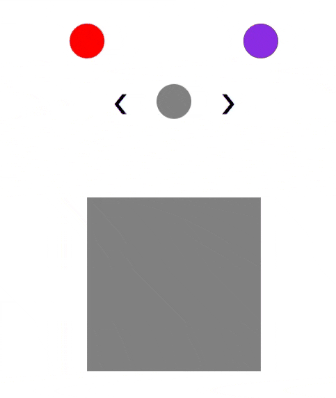
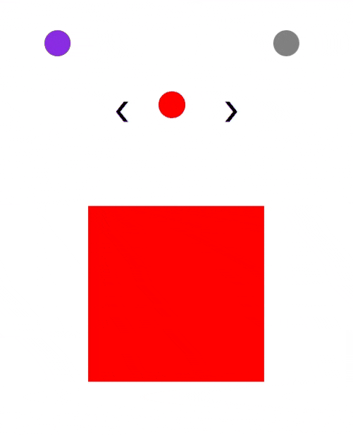

  <a href="#elliptical_carousel-pt-br">Português-BR</a> |
  <a href="#elliptical_carousel-en">English</a>

---

---

## CARROSSEL ELÍPTICO (PT-BR) 

Este projeto é uma demonstração visual de um **carrossel elíptico animado** utilizando **HTML, CSS e JavaScript puro**, sem bibliotecas externas. O carrossel apresenta três círculos que se movem em uma trajetória elíptica ao serem rotacionados, sincronizados com quadros (squares) correspondentes que exibem conteúdo associado.

### Funcionalidades

- Três elementos circulares com cores distintas.
- Animação suave: trajetória elíptica para o círculo central e linear para os círculos laterais.
- Sincronização entre o círculo central e os quadros exibidos abaixo.
- Controle de rotação por setas posicionadas à esquerda e à direita.

### Tecnologias Utilizadas

- HTML5
- CSS3
- JavaScript (Vanilla)

---

## ELLIPTICAL CAROUSEL (EN) 

This project is a visual demonstration of an **animated elliptical carousel** built using **pure HTML, CSS, and JavaScript**, without any external libraries. The carousel features three colored circles moving along an elliptical path upon navigation, synchronized with corresponding square panels below.

### Features

* Three circle elements with distinct colors.
* Smooth animation: elliptical for the center circle and linear for the side circles.
* Frame switching synchronized with the central circle's position.
* Navigation controls using left and right arrows.

### Technologies Used

* HTML5
* CSS3
* Vanilla JavaScript